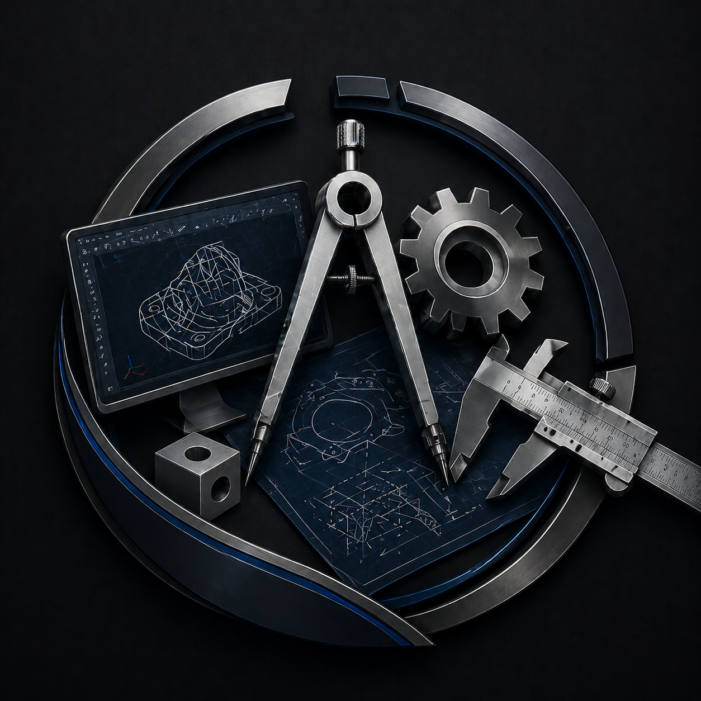
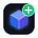
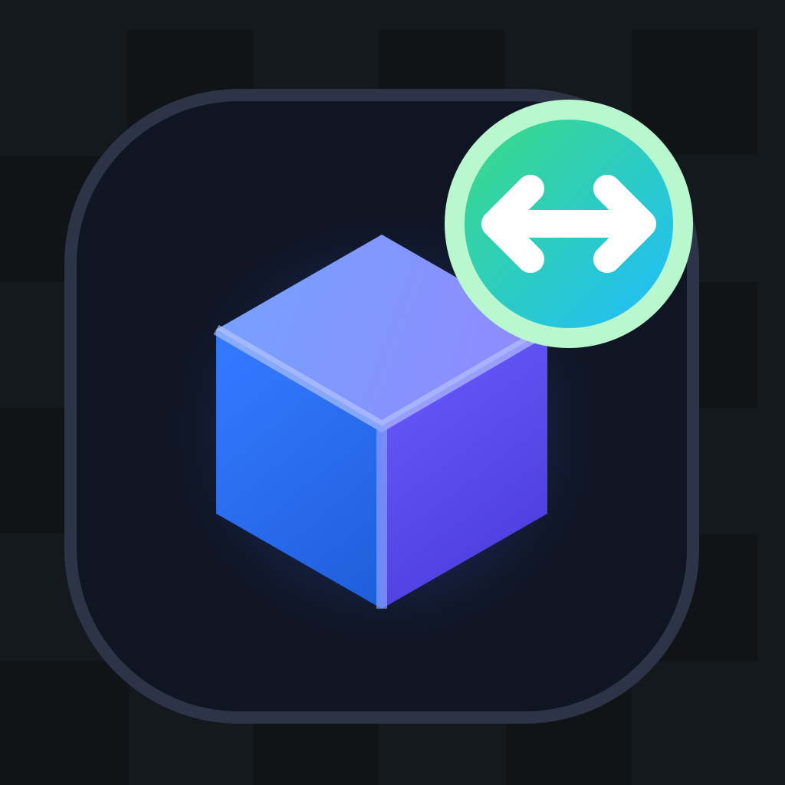
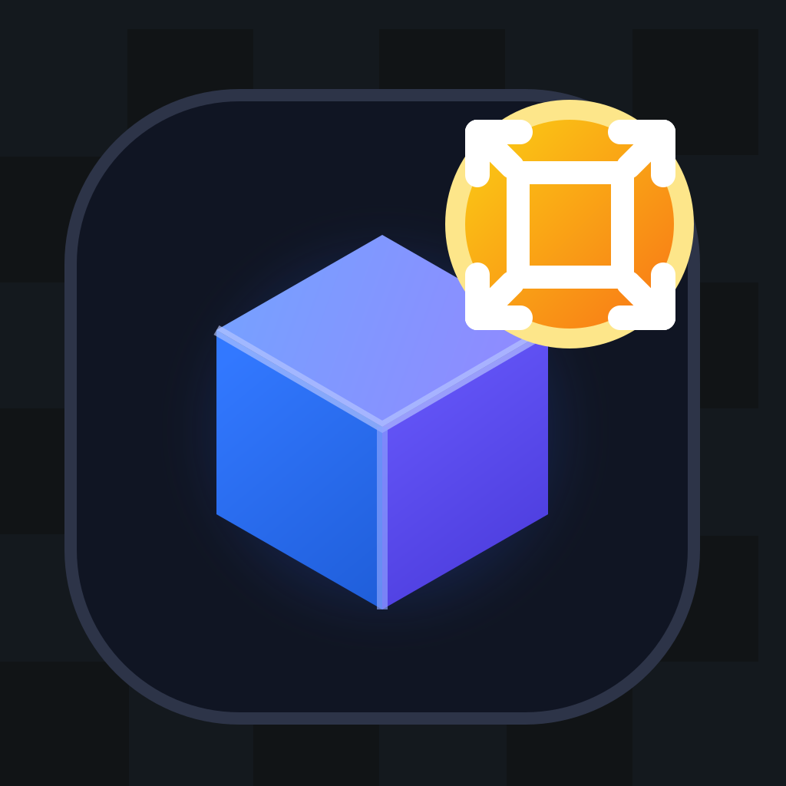
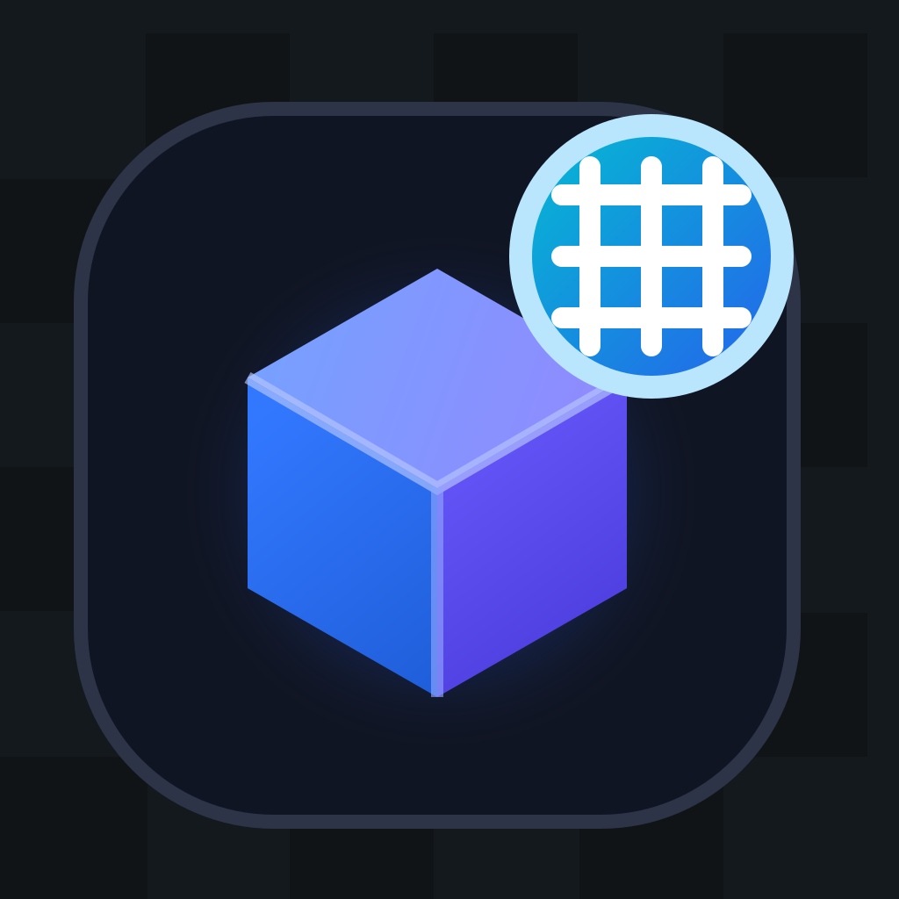
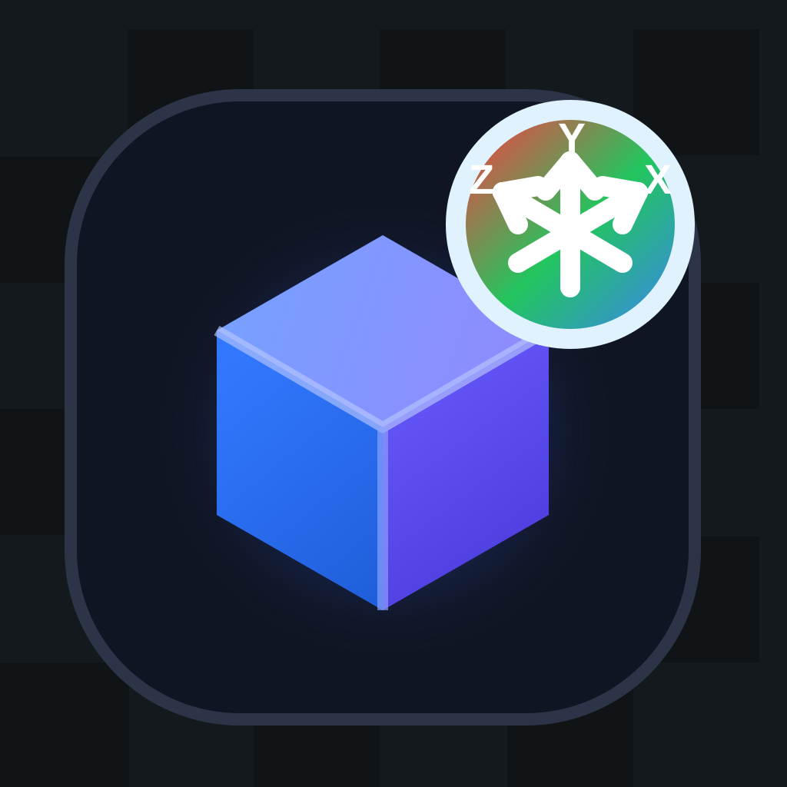

# Objex CAD

Objex CAD is a Flask-based 3D CAD web application for creating, editing, saving, previewing, importing, and exporting simple 3D projects. It uses Python Flask, Jinja templates, MySQL, JavaScript, and Three.js.

<p align="center">
  
</p>

## Main Features

- User registration, login, logout, and profile name update.
- Dashboard with recent project preview.
- Project create, open, rename, delete, import, and search.
- CAD workspace with 3D objects, object properties, transform controls, materials, undo, redo, zoom, reset workspace, and drag resize.
- Save design data to MySQL and reopen saved projects.
- Export as image and export 3D model files.
- Help, settings, and project management pages.
- MVC/OOP structure with controllers, routes, models, and Jinja templates.

## Visual Guide

These images are stored inside the project, so they will also show on GitHub after the repo is pushed.

| App Logo | Add Shape | Move | Resize | Export Image | Export 3D Model |
|---|---|---|---|---|---|
|  |  |  |  |  |  |

| Undo | Redo | Grid | Axes | Orbit | Reset |
|---|---|---|---|---|---|
|  |  |  |  |  |  |

## Project Structure

```text
Objex_CAD/
├── app/
│   ├── controllers/
│   │   ├── base_controller.py
│   │   ├── auth.py
│   │   ├── home.py
│   │   └── project.py
│   ├── models/
│   │   ├── base_model.py
│   │   ├── database.py
│   │   ├── user.py
│   │   └── project.py
│   ├── routes/
│   │   ├── auth.py
│   │   ├── home.py
│   │   └── project.py
│   ├── static/
│   │   ├── css/
│   │   ├── images/
│   │   └── js/
│   ├── templates/
│   │   ├── base.html
│   │   ├── index.html
│   │   ├── register.html
│   │   ├── dashboard.html
│   │   ├── projects.html
│   │   ├── cad.html
│   │   ├── help.html
│   │   └── settings.html
│   ├── auth.py
│   └── __init__.py
├── Test/
│   ├── __init__.py
│   ├── test_auth_controller.py
│   └── test_demo_flask.py
├── .env.example
├── config.py
├── requirements.txt
├── run.py
└── README.md
```

## Requirements

Install these before running the project:

- Python 3.10 or newer
- MySQL Server
- pip
- A modern browser such as Chrome, Edge, Firefox, or Safari

Python packages are listed in `requirements.txt`:

```text
flask
flask-cors
PyMySQL
python-dotenv
werkzeug
```

## Clone And Setup

Run these commands from the folder where you want to keep the project.

```bash
git clone <your-github-repo-url>
cd Objex_CAD
```

Create and activate a virtual environment.

macOS/Linux:

```bash
python3 -m venv .venv
source .venv/bin/activate
```

Windows:

```bash
python -m venv .venv
.venv\Scripts\activate
```

Install dependencies:

```bash
pip install -r requirements.txt
```

## Environment Setup

Copy the example environment file:

macOS/Linux:

```bash
cp .env.example .env
```

Windows:

```bash
copy .env.example .env
```

Then open `.env` and update it for your MySQL setup:

```env
MYSQL_HOST=localhost
MYSQL_USER=root
MYSQL_PASSWORD=your_mysql_password
MYSQL_DATABASE=objex_cad
JWT_SECRET=change_this_secret_key
PORT=5001
```

The real `.env` file is ignored by Git, so do not push passwords or secret keys to GitHub.

## Database Setup

Start MySQL before running the Flask app.

The application automatically creates the database and tables on startup:

- Database: `objex_cad`
- Tables: `users`, `projects`

This works when your MySQL user has permission to create databases.

If your MySQL user does not have create permission, create the database manually:

```sql
CREATE DATABASE objex_cad;
```

Then run the app again. The tables will still be created automatically.

## Run The Application

Start the Flask server:

```bash
python3 run.py
```

On Windows, use:

```bash
python run.py
```

Open this URL in your browser:

```text
http://127.0.0.1:5001
```

If you changed `PORT` in `.env`, use that port instead.

## How To Use The App

1. Open the app in your browser.
2. Create a new account from the register page.
3. Login with your email and password.
4. Click `+ New Project` to create a CAD project.
5. Open the project from the dashboard or projects page.
6. Use the CAD toolbar to add and edit 3D objects.
7. Change object position, rotation, scale, color, and material properties from the right properties panel.
8. Click `Save Design` before leaving the CAD workspace.
9. Go back to the dashboard to see the latest project preview.
10. Use export tools to export an image or 3D model file.

## CAD Workspace Controls

| Feature | What It Does |
|---|---|
| Add Shape | Adds cube, sphere, cylinder, cone, torus, pyramid, or plane objects. |
| Move Object | Move selected objects manually or by dragging. |
| Resize Object | Resize selected objects using object controls. |
| Rotate Object | Rotate selected objects. |
| Duplicate Object | Create duplicate objects with offset and count options. |
| Delete Object | Remove selected objects. |
| Color | Change selected object color. |
| Materials | Change material type and properties such as roughness, metalness, and opacity. |
| Undo | Undo recent CAD actions. |
| Redo | Redo previously undone actions. |
| Reset Workspace | Clears the workspace after confirmation. |
| Export Image | Download a picture of the current CAD view. |
| Export 3D Model | Export the design as a supported 3D model format. |

## Keyboard Shortcuts

| Shortcut | Action |
|---|---|
| `Ctrl + Z` or `Cmd + Z` | Undo |
| `Ctrl + Y` or `Cmd + Y` | Redo |
| `Ctrl + Shift + Z` or `Cmd + Shift + Z` | Redo |

## Project Pages

### Dashboard

- Shows the most recent project.
- Displays a 3D preview of the saved project content.
- Provides quick access to recent project actions.

### Projects

- Lists all saved projects.
- Search is case-sensitive, so uppercase and lowercase characters are different.
- Allows opening, renaming, deleting, and importing projects.

### Settings

- Shows user settings.
- Allows changing the displayed username with confirmation.

### Help

- Gives a visual guide for common CAD tools and workflows.

## Tests

Run all tests:

```bash
PYTHONDONTWRITEBYTECODE=1 python3 -m unittest discover -s Test -v
```

Windows:

```bash
set PYTHONDONTWRITEBYTECODE=1
python -m unittest discover -s Test -v
```

Expected result:

```text
Ran 18 tests
OK
```

## OOP And MVC Notes

This project uses Python OOP and MVC-style separation:

- `routes` classes register Flask blueprints.
- `controllers` classes handle request logic.
- `models` classes handle database logic.
- `BaseController` provides shared controller helpers.
- `BaseModel` provides shared model/database helpers.
- Jinja templates extend `base.html`.

Important classes:

- `AuthController`
- `HomeController`
- `ProjectController`
- `AuthRoutes`
- `HomeRoutes`
- `ProjectRoutes`
- `User`
- `Project`
- `Database`

## Common Problems

### MySQL connection failed

Check that MySQL is running and your `.env` values are correct.

```env
MYSQL_USER=root
MYSQL_PASSWORD=your_mysql_password
```

### Database is not created

Your MySQL user may not have permission to create databases. Run this once in MySQL:

```sql
CREATE DATABASE objex_cad;
```

### Port already in use

Change the port in `.env`:

```env
PORT=5002
```

Then run:

```bash
python3 run.py
```

### Static icons or CSS do not update

Hard refresh the browser:

```text
Ctrl + Shift + R
```

On macOS:

```text
Cmd + Shift + R
```

## Submission Checklist

- MySQL is installed and running.
- `.env` is created from `.env.example`.
- Dependencies are installed from `requirements.txt`.
- The app starts with `python3 run.py`.
- Browser opens `http://127.0.0.1:5001`.
- Tests pass with `python3 -m unittest discover -s Test -v`.
- Do not push the real `.env` file to GitHub.
